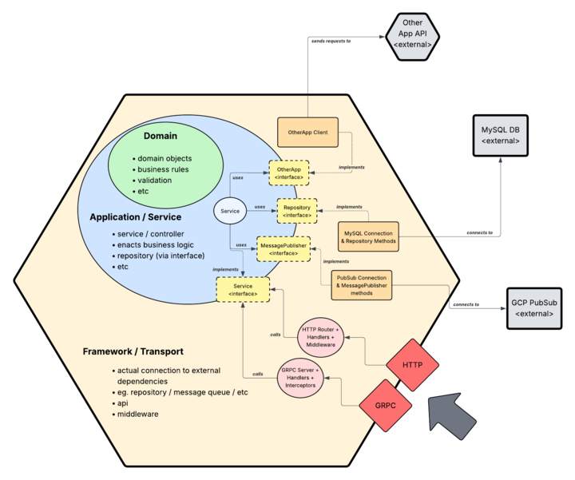

# Go Blueprint

## Overview

Go Blueprint is a small, opinionated microservice written in Go that demonstrates the fundamentals of hexagonal architecture in a backend context. The service focuses on user management and is intentionally kept simple to emphasise structure, boundaries, and design principles over feature complexity.

This project was created as a learning exercise to:

* Gain hands-on experience with Go.
* Understand how backend systems can be structured cleanly.
* Learn how to separate concerns using hexagonal architecture.
* Practice breaking down problems into composable, testable parts.

---

## Architectural Philosophy

This project follows hexagonal architecture, also known as ports and adapters. The core idea is:

* The domain contains the business logic and rules.
* External concerns (databases, HTTP, messaging, etc.) are adapters.
* Dependencies always point inward, toward the domain.

This makes the system:

* Easier to test.
* Easier to refactor.
* Less coupled to frameworks and infrastructure.



---

## Project Structure

Below is an overview of the directory layout and the responsibility of each layer.

```
cmd/
└── app/

internal/
├── datastore/
│   └── inmem/
├── domain/
│   └── users/
├── service/
│   └── mocks/
```

---

## Layer Breakdown

### `cmd/`

The `cmd` directory contains application entry points. Each subdirectory represents a runnable application.

#### `cmd/app`

* The main executable for the service
* Responsible for:

  * Bootstrapping the application.
  * Wiring dependencies together.
  * Starting the HTTP server (or other transports).

No business logic should live here — only configuration and setup.

---

### `internal/`

The `internal` directory contains all application code that should not be imported by external projects. This enforces clear boundaries and encapsulation.

---

### `internal/domain/`

The domain layer is the heart of the application.

#### `internal/domain/users`

* Defines the user entity and related business rules.
* Contains:

  * Core data structures.
  * Domain logic.
  * Interfaces (ports) that describe required behaviors (e.g., repositories).

This layer:

* Has no knowledge of databases, HTTP, or frameworks.
* Should be highly testable.
* Represents the problem space, not the solution details.

---

### `internal/datastore/`

This directory contains infrastructure adapters that fulfill domain interfaces.

#### `internal/datastore/inmem`

* An in-memory implementation of persistence interfaces.
* Used for:

  * Local development.
  * Testing.
  * Demonstrating how adapters plug into the domain.

Other implementations (e.g., SQL, NoSQL) could be added later without changing domain logic.

---

### `internal/service/`

The service layer coordinates interactions between the domain and external systems.

Responsibilities include:

* Executing use cases.
* Orchestrating domain operations.
* Acting as a boundary between handlers and domain logic.

This layer depends on domain interfaces, not concrete implementations.

#### `internal/service/mocks`

* Mock implementations for testing.
* Allows isolation of domain and service logic during unit tests.

---

## Key Takeaways

This project emphasises:

* Clear separation of concerns.
* Dependency inversion.
* Testability by design.
* Simplicity over completeness.

It is not meant to be production-ready, but rather a blueprint for understanding how Go services can be structured cleanly and sustainably.
